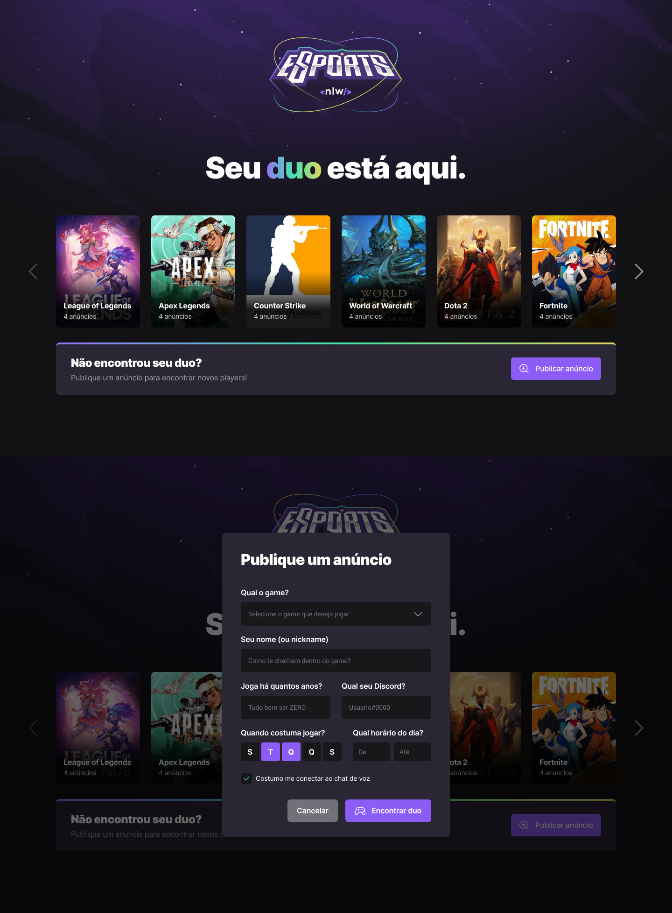
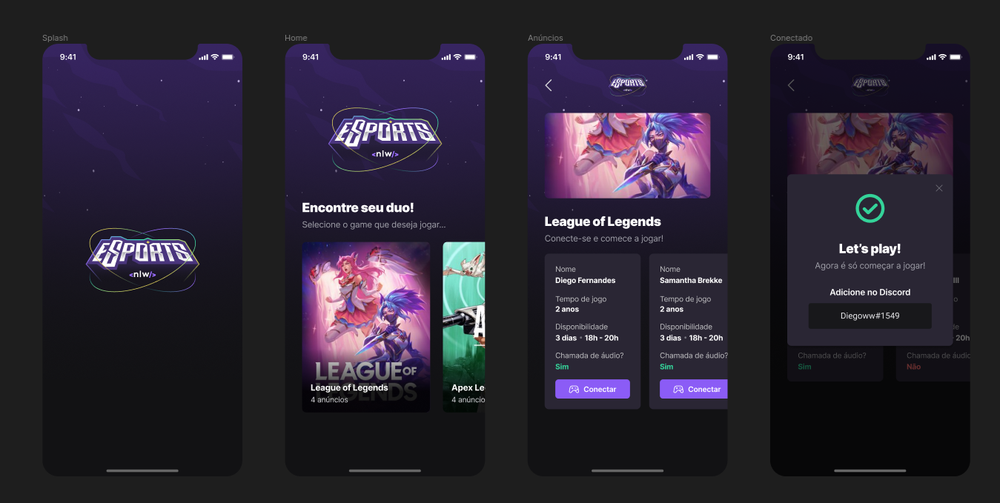

# NLW-eSports 🎮

### Esse projeto foi desenvolvido durante a Next Level Week eSports da Rocketseat.

# 🖼 Projeto (Web)

## 🖼 Projeto (Mobile)

## 🛠️ Tecnologias/Ferramentas utilizadas

* **Web**
  * React
  * Vite
  * Radix
  * Tailwind
  * TypeScript
* **Mobile**
  * React Native
  * Expo
  * React Navigation
  * TypeScript
* **Backend**
  * Node
  * Express
  * TypeScript
  * Prisma
